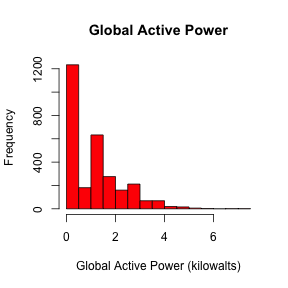
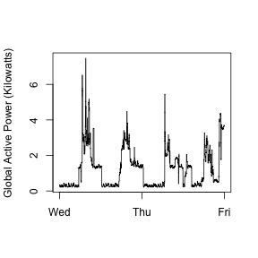
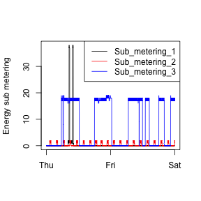
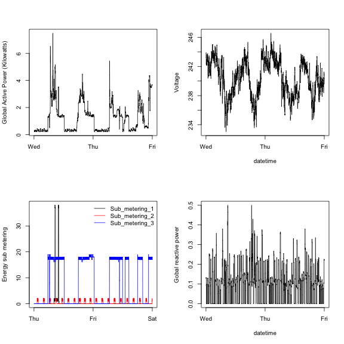

Title
========================================================


Figure 1:


```r
plot.one(FALSE)
```

 


Figure 2:


```r
plot.two(FALSE)
```

 


Figure 3:


```r
plot.three(FALSE)
```

 


Figure 4:


```r
plot.four(FALSE)
```

 

